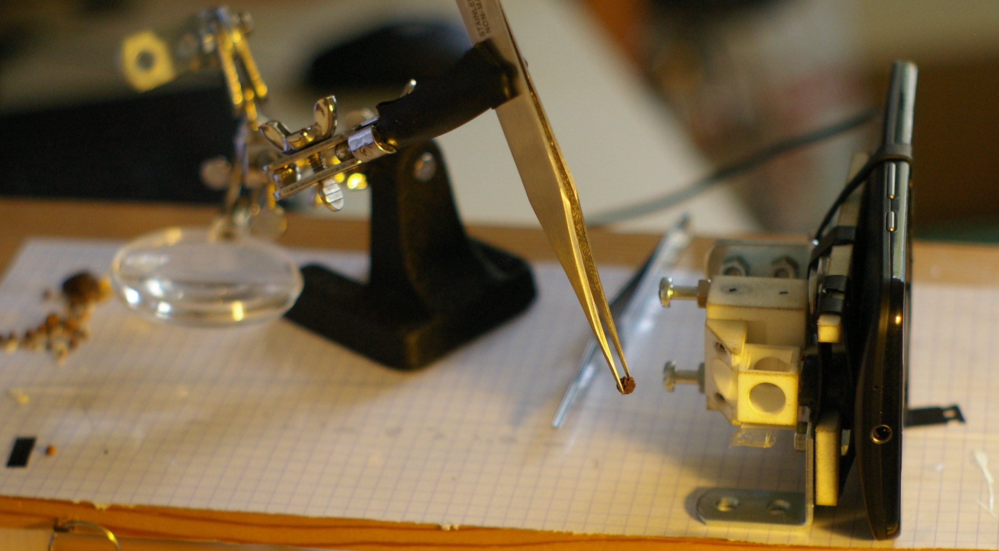
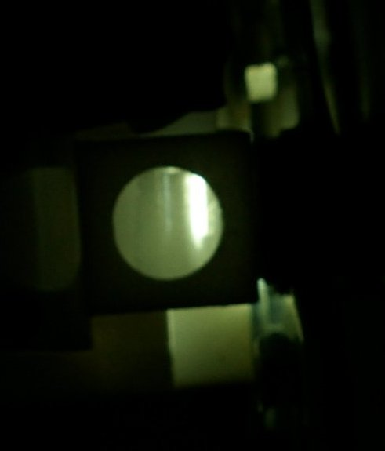
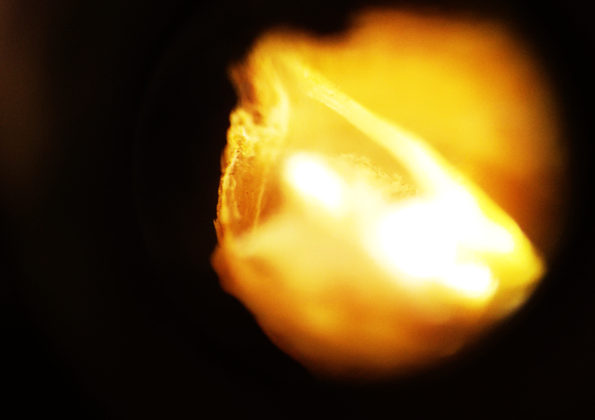
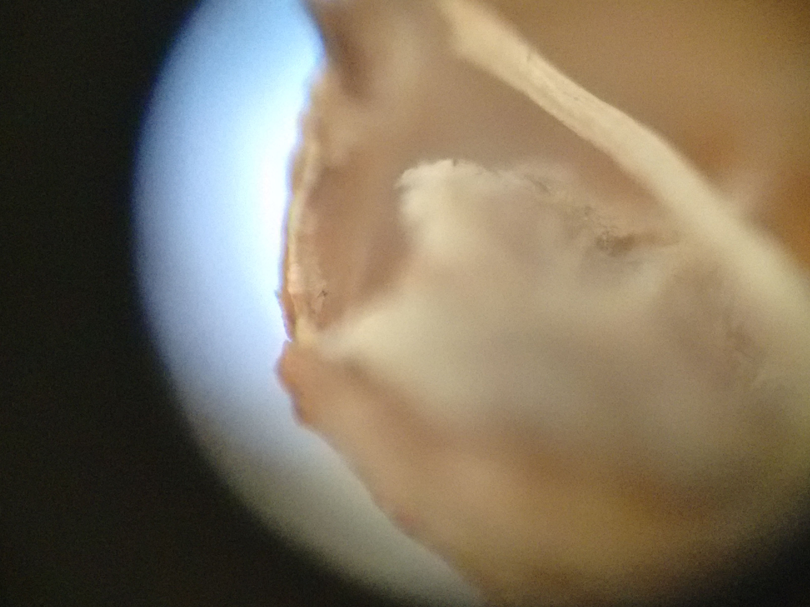

# This is the mu spim project -- welcome

Mu-spim implements **light sheet microscopy** on a
smartphone camera.

_Le Mu-spim est un microscope à **feuille de lumière** pour smartphone_

 

To take an image, one suspends the sample (here a grain of peper) in the small cubic room, in front of the telephone's objective.

_Pour prendre une image, on suspend l'échantillon (ici un grain de poivre) dans
la petite chambre cubique, devant l'objectif du téléphone_

The microscope uses the phone's LED flash to illuminate the sample, and a **cylindrical lens** creates a light-sheet. A section of the flat light field can be seen on the next image:

_Le microscope utilise la LED du téléphone pour illuminer un échantillon, et **une lentille cylindrique** créé une feuille de lumière. On voit ce champ lumineux par la tranche sur l'image suivante_

### La graîne de coriandre...

#### Avec la feuille de lumière (qui éclaire depuis la gauche)

#### Sans la feuille de lumière

### Videos

<iframe src="https://player.vimeo.com/video/138321561" width="500" height="281" frameborder="0" webkitallowfullscreen mozallowfullscreen allowfullscreen></iframe> 
<a href="https://vimeo.com/138321561">Fleur s&ecirc;ch&eacute;e // Microscopy image of a flower stem. #mu-spim</a> from <a href="https://vimeo.com/user12210065">glyg</a> on <a href="https://vimeo.com">Vimeo</a>.

<iframe src="https://player.vimeo.com/video/138322430" width="500" height="281" frameborder="0" webkitallowfullscreen mozallowfullscreen allowfullscreen></iframe> 
<a href="https://vimeo.com/138322430">Cardamome #mu-spim</a> from <a href="https://vimeo.com/user12210065">glyg</a> on <a href="https://vimeo.com">Vimeo</a>.

> This is an early project under heavy development
>
> Guillaume Gay - http://damcb.com - guillaume@damcb.com

 Mu-SPIM de <a xmlns:cc="http://creativecommons.org/ns#" href="http://damcb.com" property="cc:attributionName" rel="cc:attributionURL">Guillaume Gay</a> est mis à disposition selon les termes de la <a rel="license" href="http://creativecommons.org/licenses/by-nc-sa/4.0/">licence Creative Commons Attribution - Pas d’Utilisation Commerciale - Partage dans les Mêmes Conditions 4.0 International</a>. Fondé(e) sur une œuvre à <a xmlns:dct="http://purl.org/dc/terms/" href="https://github.com/glyg/mu_spim" rel="dct:source">https://github.com/glyg/mu_spim</a>.
