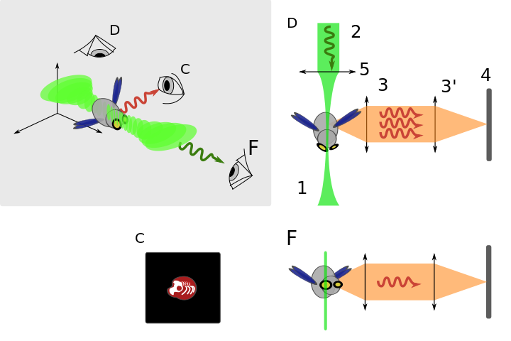
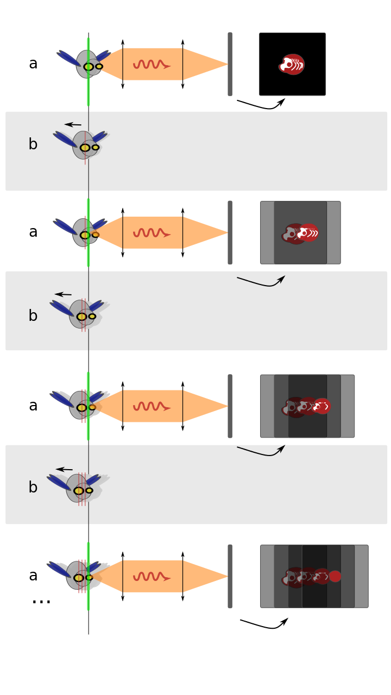

# Mu-spim
### Un microscope 3D pour smartphone

## La microscopie à feuille de lumière

L'idée de base de ce type de microscope est de produire une _feuille
de lumière_ pour éclairer un échantillon par la tranche.

En acquérant successivement plusieurs tranches de l'échantillon, on
parvient à reconstruire une vue en trois dimensions de ce dernier.

Cette méthode de microscopie a été redécouverte par le groupe de Enrst
Stelzer au milieu des années 2000.
