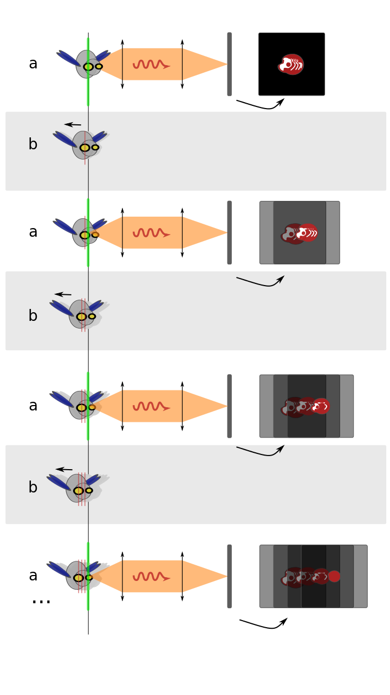

# Mu-spim
### Un microscope 3D pour smartphone

## Introduction

Mon premier appareil photo était un petit compact Olympius, le µ-one,
offert pour mes quatorze ans. Il tenait dans la pomme de la main,
avait un zoom réglable et faisait des belles photos - sur pellicule,
au risque de trahir mon âge.

Le mu-spim aussi tient dans le creux de la main et permet de fixer le
monde qui nous entoure. L'échelle est bien différente de mon petit
appareil compact, cependant: on regarde du petit, du minuscule, plus
petit que le millimètre. Le mu-spim est un microscope portable qui
s'attache à un smartphone. En faisant tourner l'échantillon devant
l'objectif, on l'observe sous toutes ses facettes et on peut en faire
une reconstruction en trois dimensions.

Ce microscope s'inspire de deux instruments existants: le premier est
le SPIM (_Selective Plane Illumination Microscope_, microscope à plan
d'illumination sélectif), un microscope à feuille de lumière (on va y
revenir!), à destination des chercheurs en biologie. C'est un appareil
de laboratoire, équipé d'une caméra hyper-sensible et de lasers pour
éclairer les échantillons. Il y a quelques années, avec Corinne
Lorenzo et Valérie Lobjois, nous avons construit un microscope de ce
type à Toulouse. Il existe une version ouverte de ce type de
microscope: [l'OpenSPIM](http://openspim.org), que l'on peut assembler
soi même, si l'on dispose d'un bon atelier d'optique.

La deuxième source d'inspiration est le merveilleux
[Foldscope](http://foldscope.org) développé à Stanford dans le
laboratoire de Manu Parkash. C'est un petit microscope en papier, que
l'on peut tenir devant ses yeux ou devant l'objectif d'un
téléphone. Il ne coûte presque rien à fabriquer et peut être employé
dans tous les terrains, par exemple pour diagnostiquer rapidement une
infection virale dans un échantillon sanguin.

Dans la tradition du développement ouvert, le Mu-Spim est un _mix_ de
ces deux outils.

Ce projet s'adresse à deux publics, principalement:

* Les amateurs, curieux et les structures de vulgarisation
  scientifique.

* Les professionnels qui auraient besoin d'un microscope précis et
  transportable pour le diagnostic micro-biologique (bilan écologique, piscines).

##

## La microscopie à feuille de lumière

L'idée de base de ce type de microscope est de produire une _feuille
de lumière_ pour éclairer un échantillon par la tranche.

En acquérant successivement plusieurs tranches de l'échantillon, on
parvient à reconstruire une vue en trois dimensions de ce dernier.

Cette méthode de microscopie a été redécouverte par le groupe de Enrst
Stelzer au milieu des années 2000.

L'objectif est avant tout **éducatif**: rendre visible le monde
foisonnant et étrange du plus-petit-que-le-cheveu.

Ce projet s'inscrit dans une démarche **ouverte**: le code et les plans
de l'objet seront distribués sous licence libre (CC-by-SA, comme le
projet parent).
